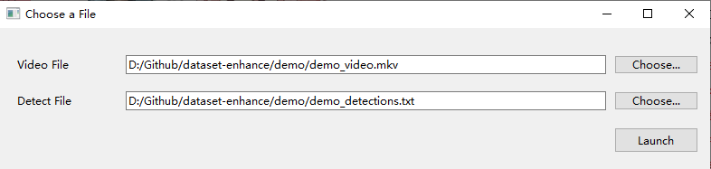
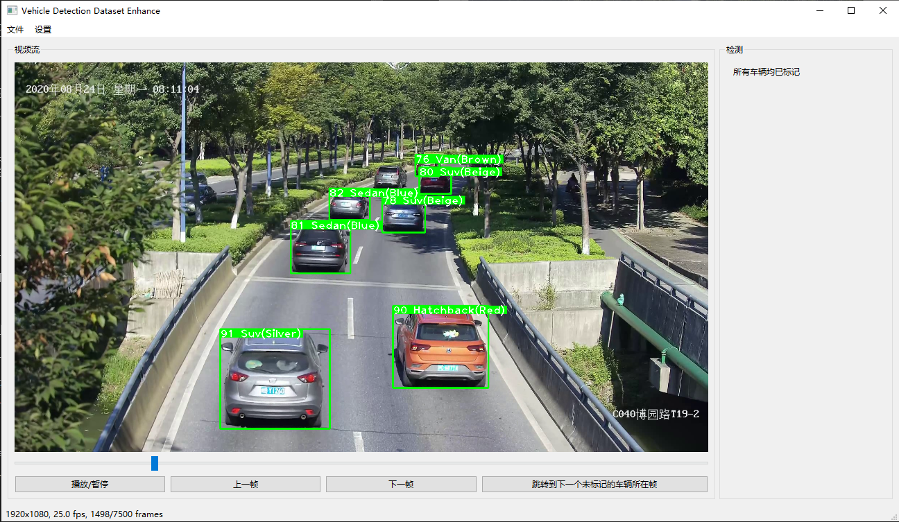
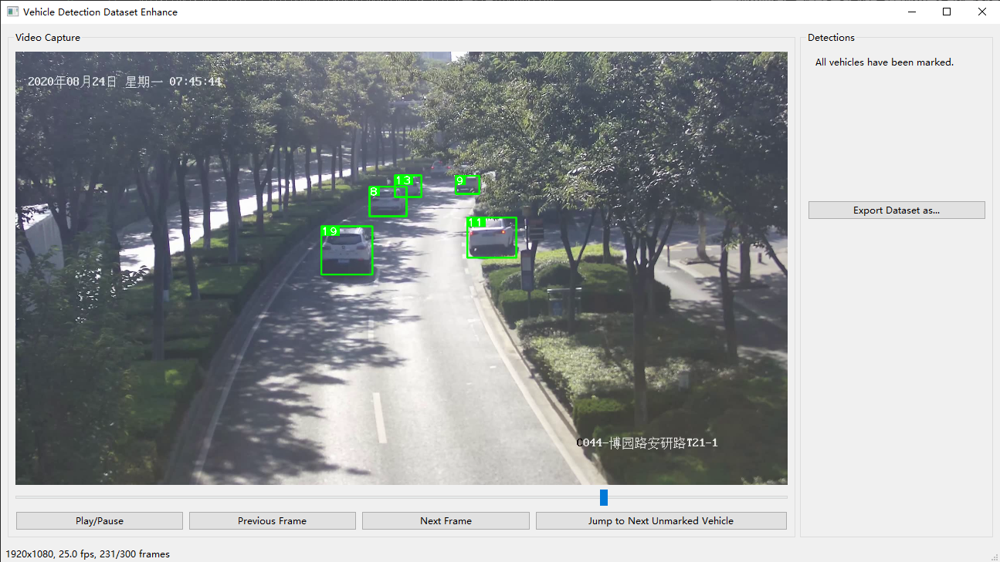

# 汽车检测数据扩容自动化辅助标记工具

## 环境配置 & 启动
```sh
pip install -r requirements.txt
python main.py
```

## 使用指南

运行程序后，将会弹出一个选择视频文件和追踪数据的窗口，选择完毕后点击启动程序。



程序主界面如下图所示，共分为视频捕获区域和检测区域。

视频捕获区域下方可播放/暂停视频、拖动进度条跳帧，或者直接跳转到下一个未标注的车辆出现的第一帧。

检测区域中会显示当前标注的车辆编号，选择颜色和类型之后点击 Mark 即可标注这辆车出现的所有框。标注完毕的框会以绿色显示。如果这个框的数据不需要标注，点击 Ignore 即可。



标注完毕后，右侧会提示所有车辆都被标注完毕。点击下方的 Export Dataset as... 即可保存文件。



保存的文件如下格式所示：
```
2 0 13 0.3736979166666667 0.40208333333333335 0.10885416666666667 0.1
2 5 13 0.5127604166666667 0.30104166666666665 0.0734375 0.06875
2 1 23 0.47213541666666664 0.19921875 0.0453125 0.03802083333333333
3 0 13 0.37421875 0.39895833333333336 0.11197916666666667 0.103125
3 5 13 0.5122395833333333 0.29713541666666665 0.0734375 0.06822916666666666
3 1 23 0.4734375 0.19791666666666666 0.04583333333333333 0.03854166666666667
4 0 13 0.37578125 0.3932291666666667 0.10677083333333333 0.09791666666666667
4 5 13 0.5119791666666667 0.2947916666666667 0.07291666666666667 0.06770833333333333
4 1 23 0.4744791666666667 0.19713541666666667 0.04479166666666667 0.03802083333333333
......
```
从左到右分别代表了视频的第几帧、车辆种类、车辆颜色、检测框中心点的xy坐标、宽度w和高度h。

## 待添加的功能
- 手动加入识别框
- 用于过滤识别框的约束或包围盒

## 备注
- 该工具暂未集成 Deepsort 或其他的追踪框架，源数据和视频需要自行导入
